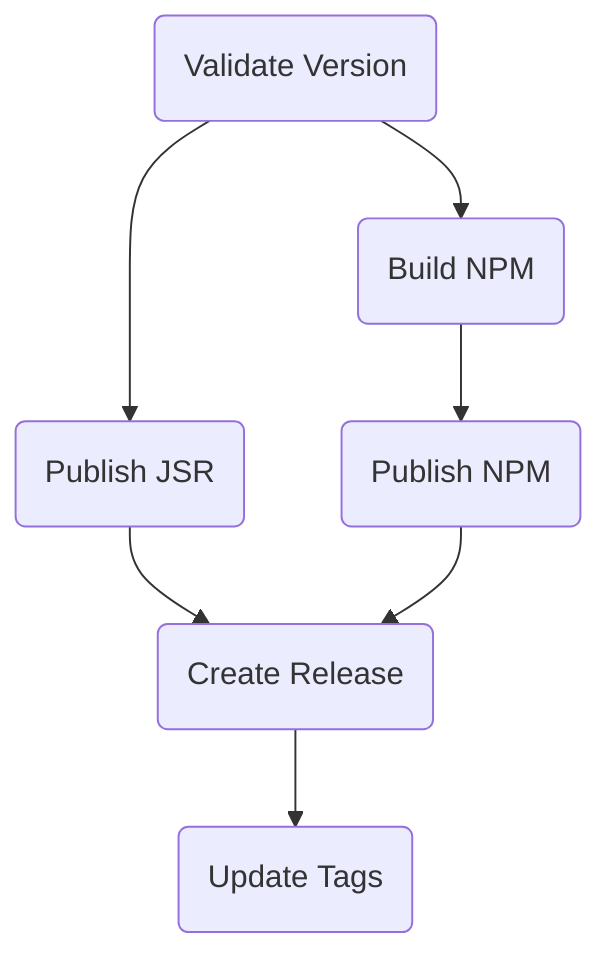

# Workflows

This diagram shows the workflow dependencies for the GitHub Actions.

- **Validate Version**: Checks that the version in `package.json` matches the
  tag.
- **Build NPM**: Builds the NPM package.
- **Publish JSR**: Publishes the package to JSR.
- **Publish NPM**: Publishes the package to NPM.
- **Create Release**: Creates a GitHub release with the built artifacts.
- **Update Tags**: Updates the tags on the repository.
