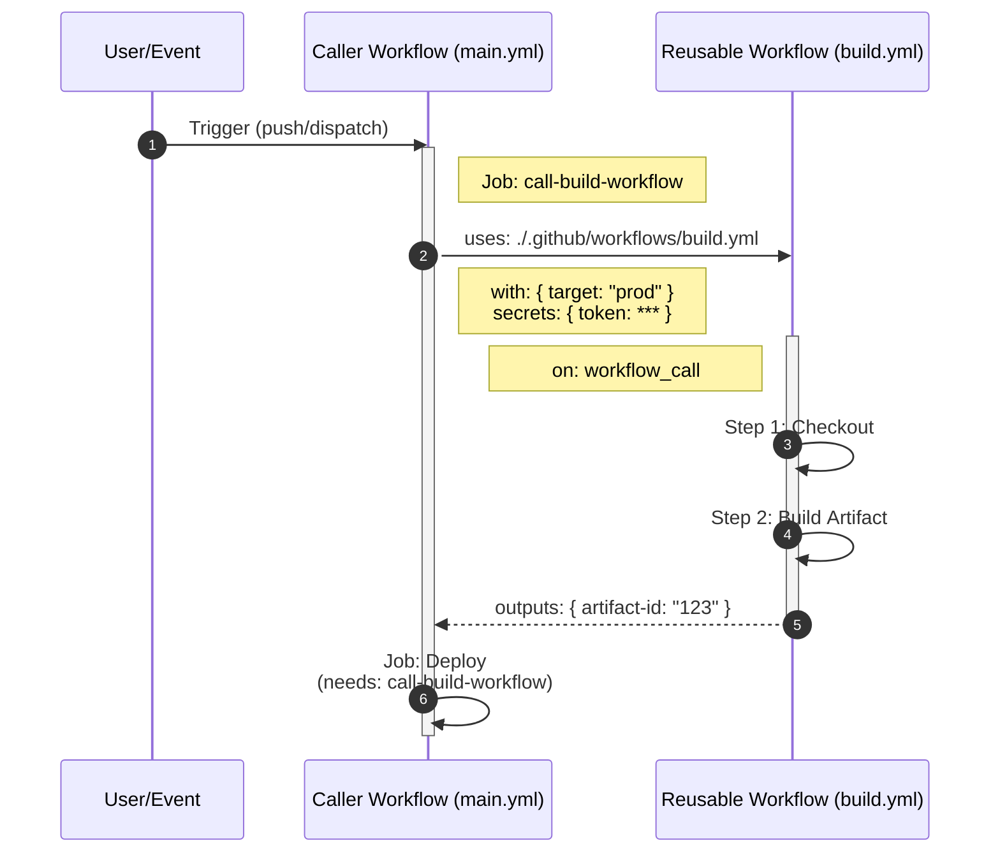
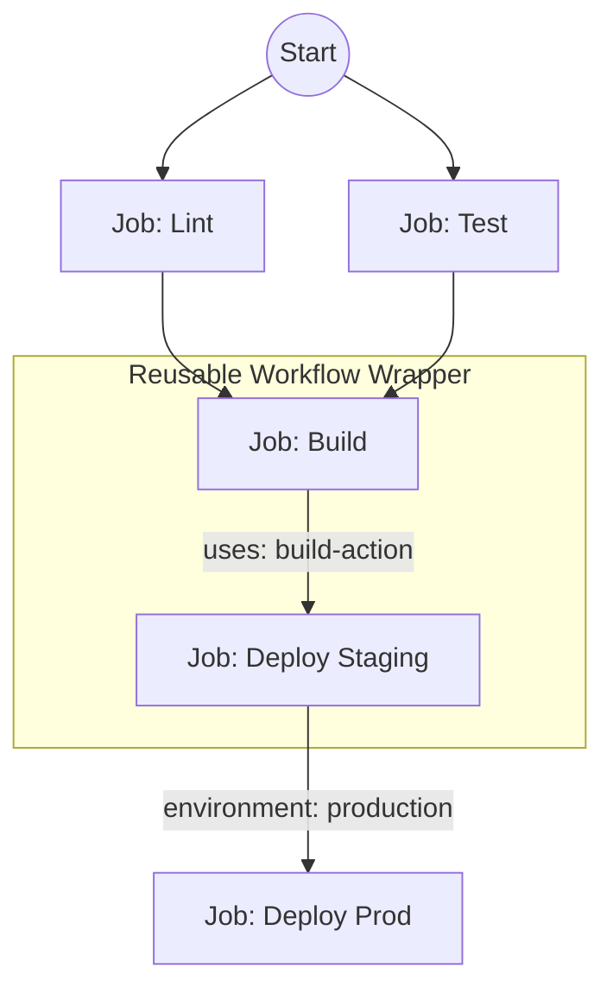
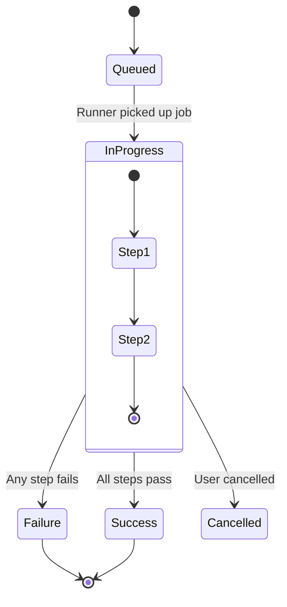

<all_provided_arguments_by_user>

$ARGUMENTS

</all_provided_arguments_by_user>

**Instructions:**

1. Analyze the file content of $1
2. Generate an appropriate mermaid diagram based on the file content and
   description
3. The diagram should clearly represent the structure, flow, or relationships in
   the code
4. Use appropriate mermaid diagram types (flowchart, sequence, class, etc.) for
   the content

**Create:**

A diagram that conforms to this description:

<description_from_user>

$2

</description_from_user>

**Key considerations:**

- Focus on the core structure and relationships in the code
- Choose the most appropriate mermaid diagram type for the content
- Keep the diagram clear and readable
- Highlight important flows, dependencies, or interactions
- Ensure the diagram is self-contained and doesn't require external references
- Make sure the diagram accurately represents the logic and data flow in the
  code

**Here are some examples of valid mermaid diagrams:**

- Flowcharts for process visualization
- Sequence diagrams for interaction flows
- Class diagrams for object relationships
- State diagrams for system states
- Entity relationship diagrams for data models

GitHub Actions workflows and reusable actions are best visualized using two
specific Mermaid chart types: **Flowcharts** (for logic/steps) and **Sequence
Diagrams** (for interactions/data flow).

Here is a breakdown of your best options, why they work for this specific use
case, and code examples you can use immediately.

## 1\. The Sequence Diagram (Best for Interactions)

This is the strongest choice for visualizing **Reusable Workflows**. It
perfectly captures the "Caller" vs. "Called" relationship, including the passing
of `inputs` and `secrets`, and receiving `outputs`.

- **Use it to show:** A "Caller" workflow triggering a "Reusable" workflow, the
  execution time, and the data returned.
- **Key benefit:** It visualizes the hierarchy and the synchronous nature of
  `workflow_call`.

**Example:**

---

## 2\. The Flowchart (Best for Job Dependencies)

Use a standard Flowchart (Graph) to visualize the internal logic of a **single
workflow** or a complex web of job dependencies (`needs`).

- **Use it to show:** Parallel jobs, conditional execution (`if:`), and the
  order of operations.
- **Key benefit:** It clearly displays the "DAG" (Directed Acyclic Graph)
  structure that GitHub Actions uses under the hood.

**Example:**

---

## 3\. The State Diagram (Best for Status/Lifecycle)

If your goal is to explain the **lifecycle** of a runner or the status
transitions of a job (e.g., queued → in-progress → completed), use a State
Diagram.

- **Use it to show:** How a custom action handles failure, retries, or
  cancellation.
- **Key benefit:** Great for documentation on "what happens if this fails?"

**Example:**

## Summary Recommendation

| If you want to visualize...                  | Use this Mermaid Type                      |
| :------------------------------------------- | :----------------------------------------- |
| **Data flow** (Inputs/Outputs between files) | **Sequence Diagram**                       |
| **Job dependencies** (`needs: [job1, job2]`) | **Flowchart (`graph TD`)**                 |
| **Logic** (If/Else inside a step)            | **Flowchart**                              |
| **Timing** (What runs in parallel)           | **Gantt Chart** (Less common but possible) |

<!-- markdownlint-disable-file MD033 MD041 -->
